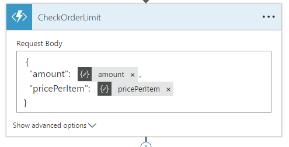
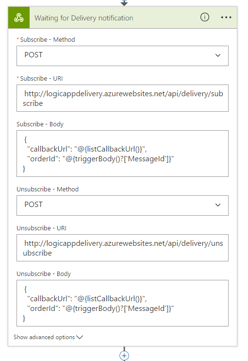

# To Do
* Logic App B2B
* Logic App Management Service

# Logic App Sample

## Preparation
### Service Bus Queue
* Create a Service Bus
* Create a Queue named **orders**
* Add a shared access policy (only listen is required) for further use

### Before the talk
* Run Delivery API with Remote Debugging


# Real world scenario

## Online-Designer
* Explain the different options (action, condition, switch, for each, du until, scope)
* Show that the following step can only access the generic **Content** property, but has no structured information
* Add an action **Data Operations > Parse JSON**
* Content = decodeBase64(**Content**)
* Schema 

```json
{
    "customerNumber": "12345",
    "articleNumber": "A1000",
    "amount": 100,
    "pricePerItem": 12.60
}
```

## Web Api
* Create a new **ASP.NET Core Web Application** project
* Choose **API**
* Create a **CustomerController**

```cs
public class CustomerController : ApiController
{
    [HttpGet]
    [Route("api/customer/{customerNumber}")]
    [Metadata("Get Customer Details", "Gets details of the customer")]
    public Task<Customer> GetCustomerById(
        [Metadata("Customer number")]string customerNumber)
    {
        return Task.FromResult(new Customer()
        {
            CustomerName = "Roman Schacherl",
            Email = "roman.schacherl@softaware.at",
            PhoneNumber = "+436644633397"
        });
    }
}
```

```cs
public class Customer
{
    public string CustomerName { get; set; }

    public string Email { get; set; }

    public string PhoneNumber { get; set; }
}
```

* Add **Swashbuckle.AspNetCore** as a NuGet Package and show Swagger
* Modify **Startup.cs**
```cs
public void ConfigureServices()
{
    services.AddSwaggerGen(c =>
    {
        c.SwaggerDoc("v1", new Info { Title = "Order API", Version = "v1" });
    });
}

public void Configure(IApplicationBuilder app, IHostingEnvironment env)
{
    app.UseSwagger();
    app.UseSwaggerUI(c =>
    {
        c.SwaggerEndpoint("/swagger/v1/swagger.json", "Order API V1");
    });
}

```

* Add **Swashbuckle.AspNetCore.MicrosoftExtensions** as a NuGet Package
* Add **Metadata** attributes to your action and parameter
* Enable extension metadata in your **Startup.cs**

```cs
public  void ConfigureServices()
{
    services.AddSwaggerGen(c =>
    {
        c.SwaggerDoc("v1", new Info { Title = "Order API", Version = "v1" });
        c.GenerateMicrosoftExtensions();
    });
}
```
* Deploy the web api to a newly created App Service
* Check the **API > API Definition** setting in Azure portal (URL must target the **HTTPS** swagger config)
* Set **CORS** policy in Azure portal to *
* Add **Azure App Services** to your workflow
* Choose the newly deployed Web API
* Show the running workflow

## Azure Functions
* Add a new **Function App** in Azure Portal
* Create a function (clicking on **New function**, not using the wizard)
* Use **GenericWebHook-CSharp** as template
* Name it **CheckOrderLimit**
* Insert and test code

```cs
public class OrderData
{
    public int Amount { get; set; }
    public decimal PricePerItem { get; set; }
}
```

```cs
#r "Newtonsoft.Json"
#load "OrderData.cs"

using System;
using System.Net;
using Newtonsoft.Json;

public static async Task<object> Run(HttpRequestMessage req, TraceWriter log)
{
    log.Info($"Checking order limit...");

    string jsonContent = await req.Content.ReadAsStringAsync();
    var data = JsonConvert.DeserializeObject<OrderData>(jsonContent);

    bool isBelowLimit = data.PricePerItem * data.Amount < 1000;

    return req.CreateResponse(HttpStatusCode.OK, new {
        isBelowLimit
    });
}
```

* Function > Integrate: Set allowed HTTP methods to only POST
* Set API Definition to content of ```functionapp-apidefinition.yaml```
* Show Swagger Viewer Extension in VS Code
* Function App: Platform Features: CORS to * and **delete all other rules**
* Add the Azure function to your Logic App workflow




## Condition
* Add a new condition to your workflow
* Switch to advanced mode
* Enter the following condition: ``` @equals(body('CheckOrderLimit')?['isBelowLimit'], true) ```
* If yes: do nothing
* If no:
  * Add an **Office 365 Send approval mail** action to your workflow
  * Add a condition afterwards to check the **SelectedOption** property
  * If no: Add a **Control > Terminate** action
* Show the running workflow

## WebHook for long-running operations
* Add a new **HTTP > HTTP Webhook** action
* Show Subscribe/Unsubscribe URL

* Create a new **ASP.NET Web Application** project
* Choose **Empty** and add **Web API**
* Create a new **DeliveryController**

```cs
[HttpPost]
[Route("api/delivery/subscribe")]
public IActionResult Subscribe([FromBody]SubscriptionData subscriptionData)
{
    return this.Ok();
}

[HttpPost]
[Route("api/delivery/unsubscribe")]
public IActionResult Unsubscribe([FromBody]SubscriptionData subscriptionData)
{
    return this.Ok();
}
```

```cs
public class SubscriptionData
{
    public string CallbackUrl { get; set; }

    public string OrderId { get; set; }
}
```

* Set up the HTTP Webhook action


## Twilio
* Add a **Twilio Send SMS** action
* Configure the connection using LIVE Credentials
* Choose phone number (43676800200395)
* Use the customer phone number as target